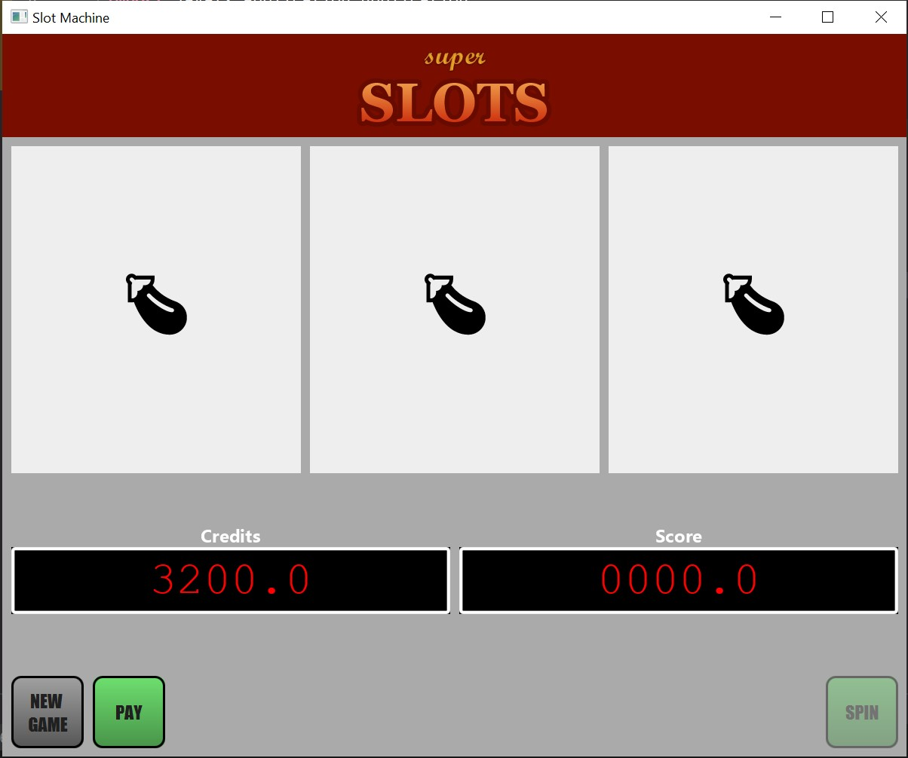

# UniTN-LDP-SlotMachine
Esercizio programma di simulazione Slot Machine
1. Scrivere un’applicazione che implementi una slot machine.
   Tutto il codice deve essere documentato con Javadoc.
   L’applicazione presenterà una finestra che ricordi vagamente
   l'immagine fornita
2. I contatori sono due:
   1. Credito (indica i soldi disponibili, espressi in centesimi,
inizialmente è 0)
   2. Punteggio (inizialmente è 0)
3. Le monete inizialmente sono 3. Sono dei cerchi su ciascuno
   dei quali è riportata la dicitura “1 Euro”.
4. Cliccando su una moneta, questa sparisce e il credito viene
   aumentato di 100.
5. I bottoni sono :
   1. Nuova partita
   2. Spin (disabilitato se il punteggio è zero)
   3. Pay (disabilitato se il credito è zero)
6. Le ruote dei simboli sono tre, uguali tra loro. Ciascuna
   contiene gli stessi sei simboli (delle figure geometriche
   stilizzate: barra inclinata a destra, rombo, cerchio, ecc.,
   scegliete voi). Ogni ruota mostra un solo simbolo alla
   volta.
7. Cliccando sul tasto “Nuova partita”, se il credito è
   inferiore a 100 appare una finestra di pop-up che dice
   “non hai credito sufficiente”. Altrimenti il credito viene
   diminuito di 100 e il punteggio viene settato a 128.
8. Se Il tasto Spin è abilitato, cliccandolo i simboli delle tre ruote
   vengono scelti in modo casuale. Ad ogni pressione del tasto
   “Spin” il punteggio viene dimezzato (ma se è 1 diventa 0).
9. Cliccando su una delle ruote dei simboli, il suo simbolo viene
   modificato (ma solo se il punteggio non è zero) scegliendolo in
   modo casuale (quelli delle altre ruote restano immutati). Il
   punteggio viene dimezzato.
10. Se i simboli mostrati dalle tre ruote sono uguali, appare una
    finestra di pop-up che dice “Hai vinto”, il credito viene
    incrementato di un valore pari al punteggio moltiplicato per
    100, il punteggio diventa zero.
11. Cliccando sul tasto “Pay” appare un pop-up
    che dice “Hai vinto XX Euro”, dove XX è il credito
    diviso 100. Il sistema viene resettato nella
    condizione iniziale.
    
## Alcune considerazioni
* Ho pubblicato questa repo come riferimento
* Quest'esercizio, tra gli altri, è propedeutico all'esame
* La grafica dell'applicazione ha sottratto una gran quantità di tempo
  al progetto: chiaramente non è una cosa che sarebbe fattibile in 
  un esame.
* La documentazione Javadoc non è scritta benissimo

## Risultato
macOS:

Windows:

## Problemi noti
* L'header dell'applicazione su macOS risulta diverso: il font usato per il corsivo non viene distribuito con il sistema
* JavaFX non ha un buon supporto delle Emoji