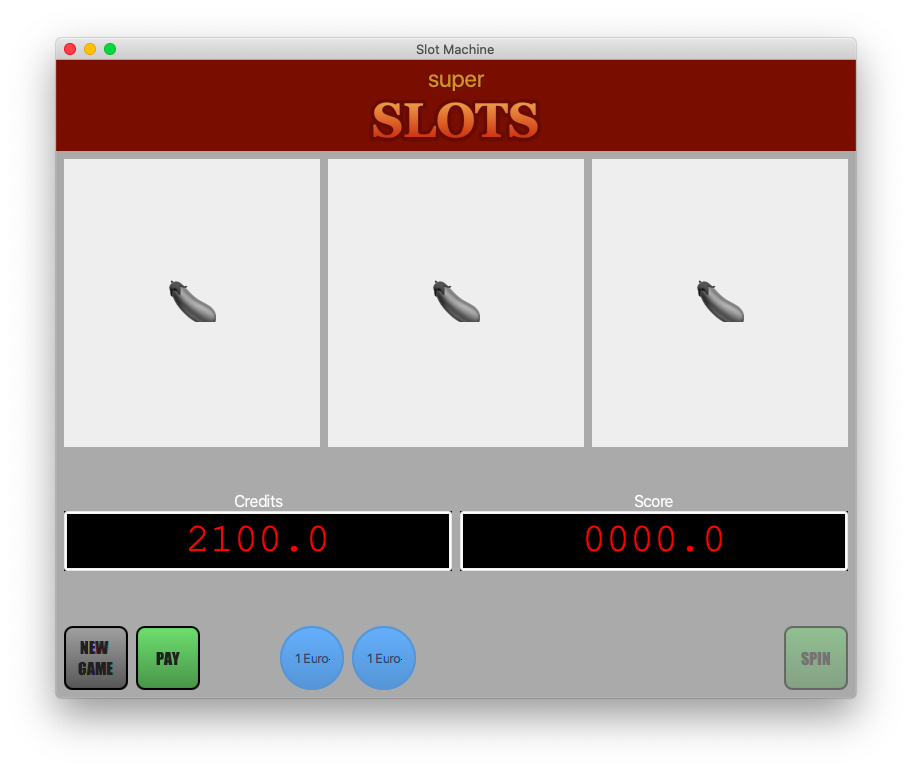
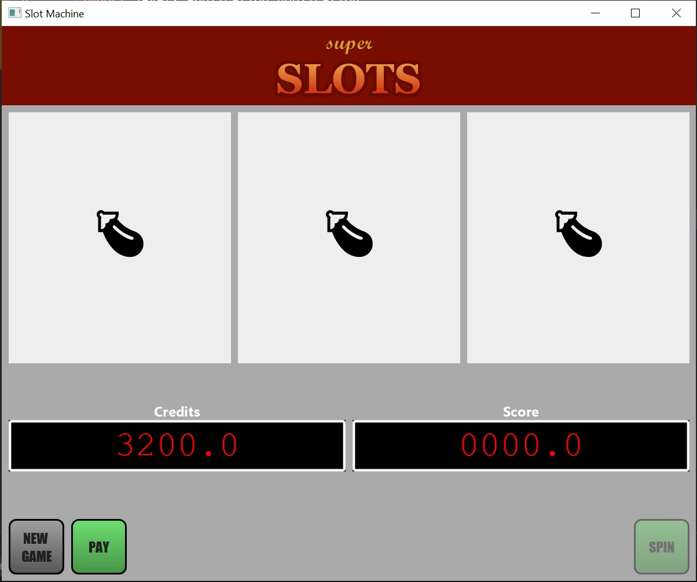

# UniTN-LDP-SlotMachine
Simulating a gambling game according to the following demands

1. `✓` Write an application that resembles the given example of a Slot Machine game.
   The code must be documented using Javadocs.
2. `✓` Implement two counters:
   1) Credits (available money in cents, starts at zero)
   2) Score (starts at zero)
3. `✓` The game starts with three coins, each coin is a circle with text "1 Euro"
4. `✓` Pressing on a coin will consume it and augment Credits by 100
5. `✓` Interaction buttons are:
    1) New Game
    2) Pay (disabled if credits amount is zero)
    3) Spin (disabled if score is zero)
6. `✓` The Slot wheels are three, each contains the same set of 6 symbols, and displays only one at a time.
7. `✓` Clicking 'New Game' will result in a pop-up window that says 'Not enough credits' **if credits amount is lower than 100**,
   otherwise, decrement credits by 100 and set score to 128.
8. `✓` If 'Spin' is enabled, clicking it will result in the slot wheels changing to random symbols.
9. `✓` Clicking on each wheel will result in its symbol to be replaced with a new random one, credits will he halved.
10. `✓` If the three wheels are equal, show a pop-up window that says "You won".
    Credit increments by a factor of `Score * 100`. Score gets resetted.
11. `✓` Clicking 'Pay' will show a pop-up that says `You won [X] Euros`, with X being `Credits / 100`, the game then resets.

## Considerations to be made
* This repository has been made public for future reference / legacy
* The exercise is meant to be preparatory to the final exam, amongst others
* Graphical enhancements made to this program took way too long to be finalised: it's clear that with limited time this won't be possible
* As of now, Javadoc documentation is poorly written

## End Result
macOS:

Windows:

## Known Issues
* macOS doesn't show the application header correctly: the system doesn't natively include the font used for the script text.
* JavaFX support for Emojis is lacking